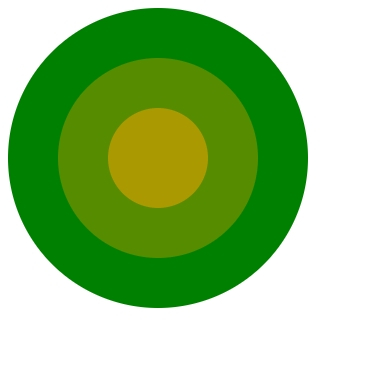

# D3.js-practice
D3.js를 공부하면서 정리한 내용입니다.

### D3 개념정리

[D3 개념정리 및 주요 api 정리](https://github.com/Joseongryun/D3.js-practice/blob/master/D3%20practice%20(%EB%A7%89%EB%8C%80%20%EA%B7%B8%EB%9E%98%ED%94%84%20%EA%B7%B8%EB%A6%AC%EA%B8%B0).md)

### D3 Practice

* [circleClickEvent]: 

  `trransition` 을 이용한 원 `click event` 제어

  * 미리보기

  

* donutGraph.html

* dotRouter.html

* dotRouterLocation.html

* fileDataDot.html

* stickGraph.html