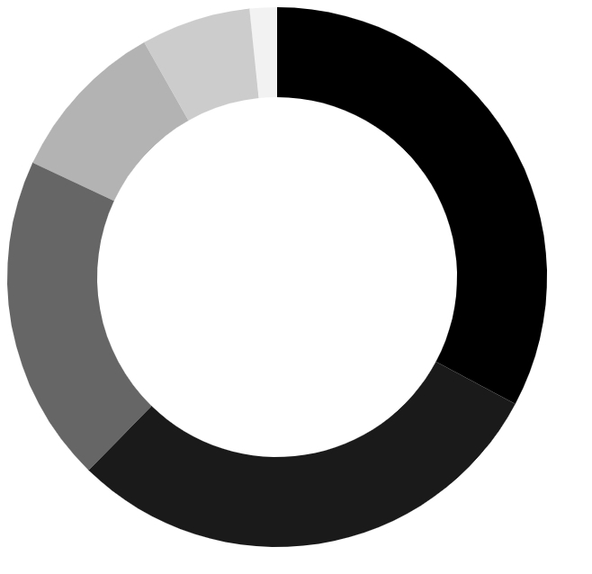
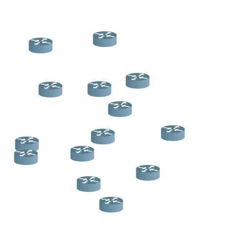
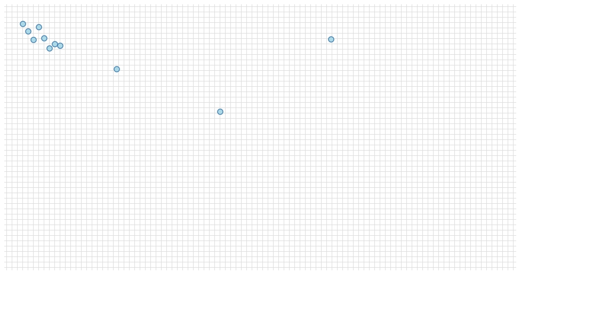
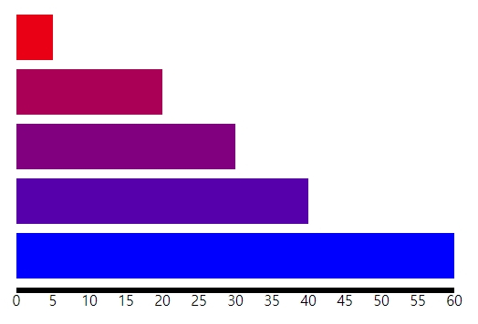
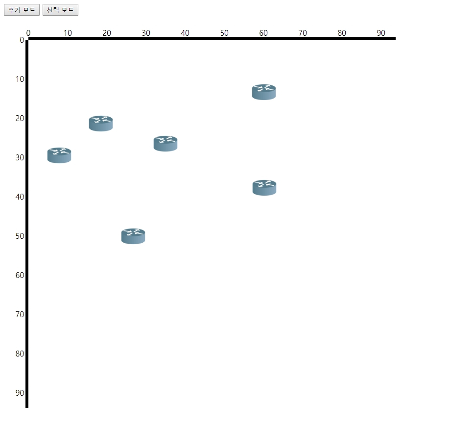

D3.js-practice

D3.js를 공부하면서 정리한 내용입니다.

### D3 개념정리

[D3 개념정리 및 주요 api 정리](https://github.com/Joseongryun/D3.js-practice/blob/master/D3%20practice%20(%EB%A7%89%EB%8C%80%20%EA%B7%B8%EB%9E%98%ED%94%84%20%EA%B7%B8%EB%A6%AC%EA%B8%B0).md)

### D3 Practice

* [circleClickEvent]: https://github.com/Joseongryun/D3.js-practice/blob/master/practice/circleClickEvent.html

  `transition` 을 이용한 원 `click event` 제어

  * 미리보기

  

* [donutGraph.html]: https://github.com/Joseongryun/D3.js-practice/blob/master/practice/donutGraph.html

  데이터 바인딩을 통한 도넛형 원형 그래프

  * 미리보기

  

* [donutRouter.html]: https://github.com/Joseongryun/D3.js-practice/blob/master/practice/dotRouter.html

  mouse 이벤트를 통한 점찍기 수준의 rotuer 그리기

  - 미리보기

  

* [fileDataDot.html]: https://github.com/Joseongryun/D3.js-practice/blob/master/practice/fileDataDot.html

  dots.tsv 에 있는 위치 정보를 기반으로 점찍기

  - 미리보기

  

* [stickGraph.html]: https://github.com/Joseongryun/D3.js-practice/blob/master/practice/stickGraph.html

  data를 기반으로 막대형 그래프 그리기

  - 미리보기

  

* [dotRouterLocation.html]: https://github.com/Joseongryun/D3.js-practice/blob/master/practice/dotRouterLocation.html

  mouse 이벤트를 통한 점찍기 수준의 rotuer 그리기 & x 축 y축 axis 추가

  - 미리보기

  

### D3 project

[cloneproject 바로가기]: https://github.com/Joseongryun/D3.js-practice/tree/master/clone/cloneProject.md

