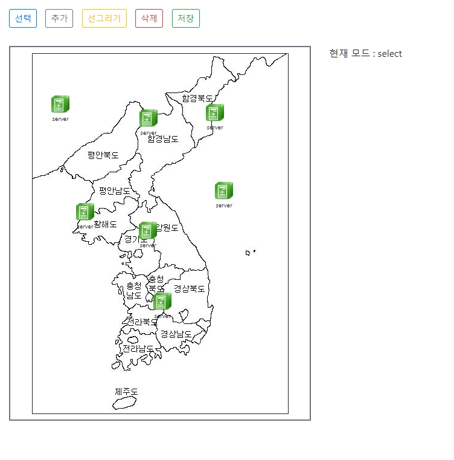

# CloneProject

여러가지 기능이 있는 d3 프로젝트를 해봅니다.

### 핵심 기능

* 서버 선택
* 서버 추가
* 서버 연결
* 서버 삭제
* 토폴로지 저장
* 토폴로지 확대 축소

### 핵심 함수 

* `nodeDraw()`

  노드를 그려준다

* `linkDraw()`

  링크를 그려준다.

* `selection.on`

  여러가지 이벤트를 핸들리 한다.

* `modeChange()`

  모드를 바꿔준다.

* `saveData()`

  정보를 `localstorage` 에 저장한다.

### 미리보기

* 선택 

  `node` 들의 위치를 변경할 수 있다. `( event : d3.behavior.drag() )`

* 추가

  원하는 좌표에 `node`를 추가 시킬 수 있다. `( event : svg.click() )`

* 선그리기

  `node`와` node`를 연결시키는 `link`를 그린다. `( event : node.mouseup(), node.mousedown() )`

* 삭제

  원하는 `node`나 `link` 를 제거 할수 있다. `( event : node.click, link.click )`

* 저장

  `node` 의 좌표와 `link` 의 정보를 `localStorage` 에 저장한다. `( function : saveData() )`

* 확대 축소

 토폴로지를 확대 축소 해준다.